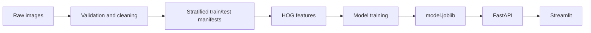
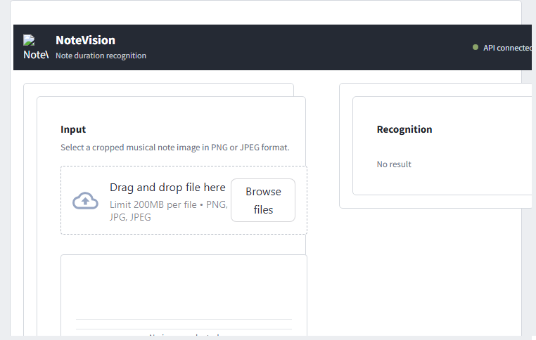

# NoteVision

NoteVision determines the duration of a musical note from an uploaded image. It is a complete CPU-friendly MLOps project for **PMLDL Assignment 1: Deployment**: data engineering, model engineering, Docker deployment, and an Apache Airflow pipeline scheduled every five minutes.

The classifier supports five labels:

| Canonical label | English | Русский |
| --- | --- | --- |
| `whole_note` | Whole Note | Целая нота |
| `half_note` | Half Note | Половинная нота |
| `quarter_note` | Quarter Note | Четвертная нота |
| `eighth_note` | Eighth Note | Восьмая нота |
| `sixteenth_note` | Sixteenth Note | Шестнадцатая нота |



## Dataset and licence

The source is Kaggle's [Music Notes Datasets by kishanj](https://www.kaggle.com/datasets/kishanj/music-notes-datasets), described there as roughly 5,000 images in the five classes above. The Kaggle dataset page lists the licence as **“Data files © Original Authors.”** Since the repository does not establish a separate right to republish the images, `data/raw/` and all generated image data are deliberately ignored by Git. The download script copies data only into the local `data/raw/` directory.

## Repository layout

```text
code/
  datasets/download_data.py        # Kaggle download without credentials in code
  datasets/preprocess.py           # validate, clean, transform, split
  models/features.py               # canonical preprocessing + HOG
  models/train.py                  # Logistic Regression, evaluation, MLflow
  deployment/api/                  # FastAPI service and Dockerfile
  deployment/app/                  # Streamlit API client and Dockerfile
  deployment/docker-compose.yml
data/raw/                           # ignored downloaded source images
data/processed/                     # ignored PNGs, CSV manifests, reports
models/                             # ignored generated model/metrics/plot
services/airflow/dags/              # scheduled real pipeline
tests/test_api.py
```

## Data engineering

`preprocess.py` recursively discovers PNG/JPG/JPEG files and recognizes labels from directory names or filenames, normalizing aliases to the five canonical labels. It verifies every file with Pillow and excludes unreadable, blank, unlabelled, and exact SHA-256 duplicate files. Raw data is intentionally not destroyed: exclusion is reproducible and counted in `data/processed/preprocessing_report.json` and timestamped logs.

Every retained image is converted to grayscale, cropped to non-white pixels, padded to a square while retaining its aspect ratio, resized to 64×64, and normalized to `[0, 1]`. It examines original width, height, and ink fraction class-by-class. Only blank/nearly full images and robust-MAD (threshold 6) extreme outliers are excluded; no arbitrary quota is applied. A fixed `random_state=42` stratified 80/20 split writes `train.csv` and `test.csv`. Hash de-duplication happens before splitting, and training validates that no hash crosses the split boundary.

## Model engineering

The model is multinomial `LogisticRegression` over 64×64 HOG features (`9` orientations, `8×8` pixels per cell, `2×2` cells per block). It is deliberately lightweight enough for CPU retraining. `class_weight="balanced"` is selected automatically if the train-class count ratio exceeds 1.2. The fixed seed is 42.

`models/model.joblib` packages the estimator together with the preprocessing/HOG configuration, classes, and timestamped model version. Training also creates `models/model_config.json`, `models/metrics.json`, `models/confusion_matrix.png`, and local MLflow runs in ignored `mlruns/`. The MLflow run contains HOG/model parameters, metrics, the confusion matrix, and model artifact.

### Metrics

The real run on the cleaned 3,929/983 train/test split produced:

| Metric | Value |
| --- | ---: |
| Accuracy | 0.981689 |
| Macro F1 | 0.981982 |
| Macro precision | 0.982024 |
| Macro recall | 0.981975 |
| Training time | 0.899 s |
| One-image inference | 0.295 ms |

The machine-readable source of truth is `models/metrics.json`; timings naturally vary with CPU load.

## Setup and local pipeline

Use Python 3.11 (Airflow 2.10 supports it) and a virtual environment.

```powershell
py -3.11 -m venv .venv
.\.venv\Scripts\Activate.ps1
python -m pip install --upgrade pip
pip install -r requirements.txt
python code/datasets/download_data.py
python code/datasets/preprocess.py
python code/models/train.py
```

For local Airflow (the Airflow container installs this automatically), use its constrained dependency set:

```powershell
pip install -r requirements-airflow.txt
```

If Kaggle authentication is required, authenticate outside the repository and retry without committing credentials. For example, after configuring a Kaggle API token in your account environment:

```powershell
$env:KAGGLE_API_TOKEN = "<token supplied by Kaggle>"
python code/datasets/download_data.py
```

Alternatively, install and authenticate Kaggle CLI according to Kaggle's documentation, download `kishanj/music-notes-datasets`, extract it under `data/raw/`, then run preprocessing. Do **not** commit `kaggle.json`, the token, or raw images.

Inspect artifacts after a successful run:

```powershell
Import-Csv data/processed/train.csv | Measure-Object
Import-Csv data/processed/test.csv | Measure-Object
Get-Item models/model.joblib,models/metrics.json,models/confusion_matrix.png
Get-Content models/metrics.json
```

## API and Streamlit deployment

First train the model, then run the two separate containers from the repository root:

```powershell
docker compose -f code/deployment/docker-compose.yml up --build -d
curl http://localhost:8000/health
```

The Streamlit container receives `API_URL=http://api:8000`; it never loads a model and communicates only over the Docker network with FastAPI.

### Streamlit interface



| Service | Address |
| --- | --- |
| FastAPI health/API | http://localhost:8000/health |
| Swagger | http://localhost:8000/docs |
| Streamlit | http://localhost:8501 |
| Airflow | http://localhost:8080 |

Example API request:

```powershell
curl.exe -X POST "http://localhost:8000/predict" -F "file=@data/processed/images/quarter_note/000000.png;type=image/png"
```

Expected fields include canonical class, English and Russian display names, confidence, all available class probabilities, and model version. Stop the services with:

```powershell
docker compose -f code/deployment/docker-compose.yml down
docker compose -f services/airflow/docker-compose.yml down
```

## Airflow automation

The `notevision_pipeline` DAG uses `*/5 * * * *`, `catchup=False`, and `max_active_runs=1`. It fails fast and only executes the next stage after a successful predecessor:

1. `validate_raw_data`
2. `preprocess_images`
3. `train_and_evaluate`
4. `deploy_services` (real `docker compose up -d --build`)
5. `check_api_health` (real HTTP `GET /health`)

Run Airflow after Docker Desktop is running:

```powershell
docker compose -f services/airflow/docker-compose.yml up --build -d
```

Open http://localhost:8080, enable `notevision_pipeline`, and trigger it with **Trigger DAG**. In an Airflow container, Docker socket mounting is Linux/WSL-oriented; on native Windows, run Airflow in WSL2 or run the DAG from a local Airflow installation that has access to `docker compose`. The model itself is intentionally compact; if an observed pipeline run exceeds five minutes, change the cron expression in `services/airflow/dags/notevision_pipeline.py` to a measured safe interval and document it.

## Tests and checks

```powershell
python -m compileall code services tests
pytest -q
docker compose -f code/deployment/docker-compose.yml config
docker compose -f code/deployment/docker-compose.yml up --build -d
curl http://localhost:8000/health
# send a real processed image with the curl command above
docker compose -f services/airflow/docker-compose.yml config
```

To confirm the DAG imports once Airflow is installed:

```powershell
airflow dags list | Select-String notevision_pipeline
airflow dags test notevision_pipeline 2026-09-16
```

## Troubleshooting

- **`No image files found`**: download/extract the Kaggle dataset under `data/raw/`; it may contain nested folders, which the loader supports.
- **Kaggle authorization error**: authenticate with Kaggle outside the repository, then re-run `download_data.py`; never add a token to code or Git.
- **API health is 503**: run preprocessing and training so `models/model.joblib` exists, then recreate the API container.
- **Streamlit cannot reach API**: use Docker Compose and leave `API_URL=http://api:8000`; `localhost` is incorrect from the app container.
- **Airflow cannot deploy**: ensure Docker Desktop/WSL is running and the Airflow executor has Docker socket/CLI access.

## TA demonstration

1. Show `data/processed/preprocessing_report.json`, manifests, and their disjoint hash columns.
2. Run `python code/models/train.py`, show metrics, confusion matrix, local `mlruns/`, and `model.joblib`.
3. Start Compose and show `docker compose ... ps` proving `notevision-api` and `notevision-app` are separate containers.
4. Open `/docs`, upload an image through Streamlit, and compare its result with the API `/predict` response.
5. Trigger `notevision_pipeline` in Airflow and show its five successful, ordered task logs and five-minute schedule.
